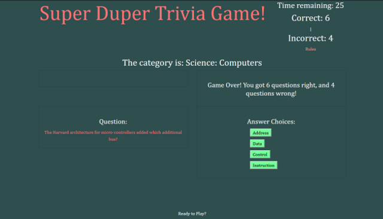

# Triviagame
This is a simple question and answer game, using a free random question API. Buttons are dynamically created with javascript and jquery and displayed on the page. Keeps track of correct and incorrect answers, and allows user 25 seconds to answer each question. If not answered in the alloted time, the game moves on to the next question, and user is penalized with 1 wrong answer added to the wrong answer counter.

## Screenshot

## Languages/Frameworks Used
HTML
CSS 
Javascript 
Jquery
Ajax
Bootstrap

